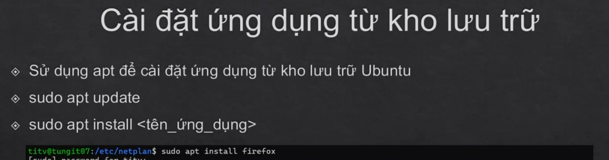
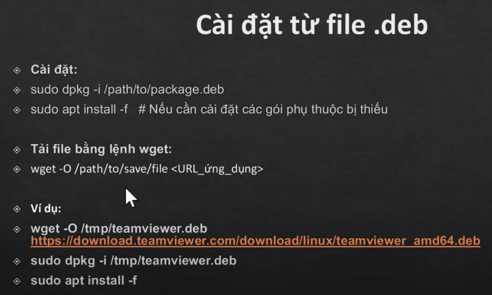

# Cài đặt ứng dụng từ kho lưu trữ

## Sử dụng apt để cài đặt từ kho lưu trữ:
- update kho lưu trữ
```
sudo apt update
```
- cài đặt đặt ứng dụng từ kho lưu trữ
```
sudo apt install <tên ứng dụng>
```


## Cài đặt từ file.deb
- tải file bằng lệnh wget:
```
wget -O /thư mục save/file <url ứng dụng>
```
- Cài đặt ứng dụng
```
sudo dpkg -i google-chrome-stable_current_amd64.deb
```
- Cài đặt các gói phụ bị thiếu
```
sudo apt install -f
```


## Gỡ bỏ ứng dụng
### Bằng lệnh sudo apt remove

Kiểm tra trình quản lý gói APT:
```
apt list | grep <tên_ứng_dụng>
```
Gỡ bỏ ứng dụng
```
sudo apt remove <tên_gói>
```
Để gỡ bỏ hoàn toàn bao gồm cả các cấu hình:
```
sudo apt purge <tên gói>
```
### Sử dụng lệnh dpkg:
```
sudo dpkg -r <tên_gói>
```
Để gỡ bỏ hoàn toàn bao gồm cả các cấu hình:
```
sudo dpkg --purge <tên_gói>
```
- Nếu bạn chỉ muốn gỡ bỏ ứng dụng mà vẫn giữ lại các cấu hình, hãy sử dụng lệnh remove thay vì purge
- Để tự động gỡ bỏ các gói phụ thuộc không còn cần thiết sau khi gỡ bỏ một gói, sử dụng lệnh:
```
sudo apt autoremove
```
