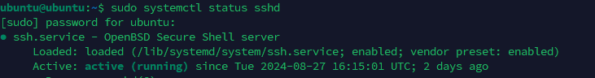

- update kho thư viện ứng dụng
```
sudo apt update
```
- cập nhật phần mềm, gói, kernel từ kho lưu trữ
```
sudo apt upgrade
```
- Kiểm tra IP server
```
ifconfig
```
Hoặc
```
ip addr
```
- Xem thông tin gateway server
```
route
```
- Mở SSH
```
sudo apt install openssh-server
```
port mở mặc định cho ssh là 22

- Mở SSH trên filewall (UFW)
```
sudo ufw allow ssh
```
- Thay đổi cổng SSH
```
sudo nano /etc/ssh/sshd_config
```


- Để thay đổi có hiệu lực, bạn cần khởi động lại dịch vụ SSH:
```
sudo systemctl restart sshd
```
- Kiểm tra xem dịch vụ SSH đã khởi động lại chưa:
```
sudo systemctl status sshd
```


Kiểm tra version ubuntu server
```
lsb_release -a
```
