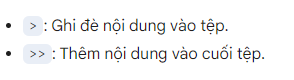

## Tạo xóa thư mục
- Tạo thư mục:
```
mkdir folder1
```
tạo nhiều thư mục
```
mkdir folder1 folder2 folder3
```
Tạo thư mục và các thư mục con
```
mkdir -p path/to/folder/subfolder
```
Tùy chọn -p sẽ tự động tạo các thư mục cha nếu chưa tồn tại.

- Xóa thư mục
Thận trọng với lệnh rm -rf: Lệnh này rất mạnh và có thể xóa toàn bộ hệ thống nếu bạn không cẩn thận. Hãy chắc chắn rằng bạn đã nhập đúng đường dẫn và chỉ định đúng thư mục cần xóa. 
###### (Sao lưu,Kiểm tra lại)

Xóa thư mục và nội dung bên trong:
```
sudo rm -r /path/to/folder
```
-r: xóa cả các thư mục con bên trong.
-f: Ép buộc xóa, không hỏi xác nhận.

Chỉ xóa thư mục trống:
```
sudo rmdir /path/to/empty_folder
```
## Tạo File
- tạo file rỗng
```
touch tên file
```
tạo nhiều file rông
```
touch file1.txt file2.txt file3.txt
```

Tạo tệp và nhập nội dung:
```
echo "Đây là nội dung của tệp" > myfile.txt
```

