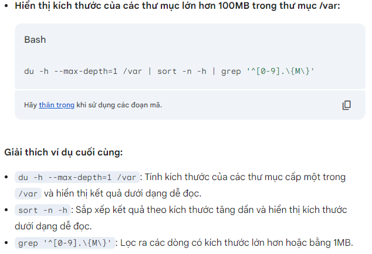
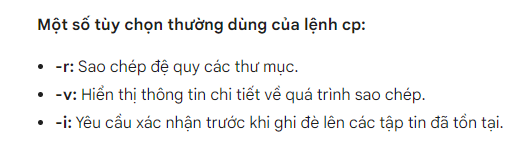
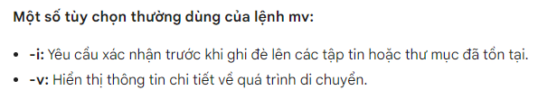
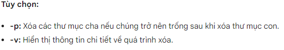
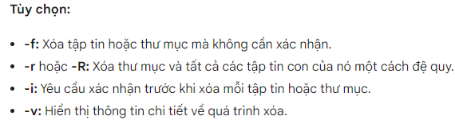
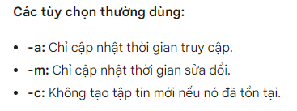

## Di chuyển giữa các thư mục
- Lệnh cd:
```
cd /path/to/directory
```
/path/to/directory: Đường dẫn đến thư mục bạn muốn di chuyển tới.

Di chuyển quay lại thư mục ngoài:
```
cd ..
```
Di chuyển đến thư mục gốc:
```
cd /
```
Di chuyển đến thư mục home:
```
cd ~
```
Di chuyển đến thư mục trước đó:
```
cd -
```

## Hiển thị thông tin vị trí thư mục
- thông tin vị trí thư mục hiện tại:
```
pwd
```

- Liệt kê thông tin các tệp và thư mục trong một thư mục cụ thể

sử dụng lệnh ll
```
ll
```
hoặc
```
ll -i
```
sử dụng lệnh tree

cài đặt apt cây thư mục
```
sudo apt  install tree
```
sử dụng bằng lệnh
```
tree
```

## Kiểm tra dung lượng đĩa
- dung lượng đĩa được sử dụng bởi các thư mục và tệp
```
du /path/to/directory
```
/path/to/directory: Đường dẫn đến thư mục bạn muốn kiểm tra dung lượng.


ví dụ:


## Sao chép di chuyển thư mục, file
- Coppy chuyển thư mục, file
```
cp [Tùy chọn] [Nguồn] [Đích]
```


- Di chuyển thư mục , file
```
mv [Tùy chọn] [Nguồn] [Đích]
```



## Tạo, xóa thư mục, tập tin
- Tạo thư mục
```
mkdir [tùy chọn] [tên_thư_mục]
```
Các tùy chọn:
-p: Tạo nhiều thư mục theo đường dẫn. Ví dụ: mkdir -p thư_mục_cấp_1/thư_mục_cấp_2
-m: Thiết lập quyền truy cập cho thư mục mới. Ví dụ: mkdir -m 755 thư_mục_mới

- Xóa thư mục rỗng
```
rmdir [tùy chọn] [tên_thư_mục]
```


- Xóa cả thư mục , tập tin
```
rm [tùy chọn] [tên_tập_tin_hoặc_thư_mục]
```


- Tạo tập tin rỗng
```
touch [tùy chọn] [tên_tập_tin]
```


- tạo tập tin và thêm nội dung vô file
```
echo "nội dung" >> [đường dẫn]
```
dấu >  sẽ ghi đè lên nội dung của file
dấu >> sẽ nối thêm nội dung vào cuối file

## xem tập tin, đếm dòng, ký tự, tìm kiếm trong file

- Xem nội dung tập tin

Cat: Hiển thị toàn bộ nội dung
```
cat [tên_tập_tin]
```

less: Xem nội dung tập tin một cách tương tác, cho phép bạn cuộn lên xuống, tìm kiếm nội dung
```
less [tên_tập_tin]
```
h: Hiển thị trợ giúp.
q: Thoát khỏi lệnh.
/: Tìm kiếm một chuỗi.
n: Tìm kiếm lần tiếp theo.
N: Tìm kiếm lần trước.

more:Tương tự như less, nhưng có ít tính năng hơn.
```
Tương tự như less, nhưng có ít tính năng hơn.
```
Space: Xem tiếp một trang.
b: Quay lại một trang.
q: Thoát khỏi lệnh.

Head: Hiển thị các dòng đầu tiên của một tập tin.
```
head [-n số_dòng] [tên_tập_tin]
```

Tail: Hiển thị các dòng cuối cùng của một tập tin.
```
tail [-n số_dòng] [tên_tập_tin]
```

- Đếm dòng ký tự của file
```
wc [Tùy chọn] [Tệp]
```
Các tùy chọn thường dùng:
-l: Đếm số dòng.
-w: Đếm số từ.
-c: Đếm số byte.
-m: Đếm số ký tự.
--lines: Tương đương với -l.
--words: Tương đương với -w.
--chars: Tương đương với -c.
--bytes: Tương đương với -c.

