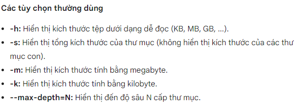

## Di chuyển giữa các thư mục
- Lệnh cd:
```
cd /path/to/directory
```
/path/to/directory: Đường dẫn đến thư mục bạn muốn di chuyển tới.

Di chuyển quay lại thư mục ngoài:
```
cd ..
```
Di chuyển đến thư mục gốc:
```
cd /
```
Di chuyển đến thư mục home:
```
cd ~
```
Di chuyển đến thư mục trước đó:
```
cd -
```

## Hiển thị thông tin
- thông tin vị trí thư mục hiện tại:
```
pwd
```

- Liệt kê thông tin các tệp và thư mục trong một thư mục cụ thể

sử dụng lệnh ll
```
ll
```
hoặc
```
ll -i
```
sử dụng lệnh tree

cài đặt apt cây thư mục
```
sudo apt  install tree
```
sử dụng bằng lệnh
```
tree
```

## Kiểm tra dung lượng đĩa
- dung lượng đĩa được sử dụng bởi các thư mục và tệp
```
du /path/to/directory
```
/path/to/directory: Đường dẫn đến thư mục bạn muốn kiểm tra dung lượng.


ví dụ:


## Sao chép di chuyển thư mục, file

