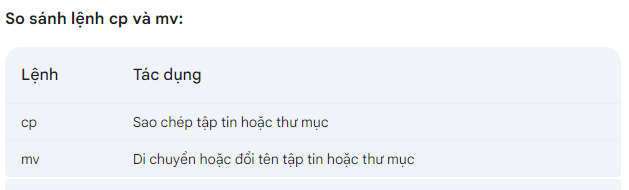

## Di chuyển giữa các thư mục
- Lệnh cd:
```
cd /path/to/directory
```
/path/to/directory: Đường dẫn đến thư mục bạn muốn di chuyển tới.

Di chuyển quay lại thư mục ngoài:
```
cd ..
```
Di chuyển đến thư mục gốc:
```
cd /
```
Di chuyển đến thư mục home:
```
cd ~
```
Di chuyển đến thư mục trước đó:
```
cd -
```

## Hiển thị thông tin vị trí thư mục
- thông tin vị trí thư mục hiện tại:
```
pwd
```

- Liệt kê thông tin các tệp và thư mục trong một thư mục cụ thể

sử dụng lệnh ll
```
ll
```
hoặc
```
ll -i
```
sử dụng lệnh tree

cài đặt apt cây thư mục
```
sudo apt  install tree
```
sử dụng bằng lệnh
```
tree
```

## Kiểm tra dung lượng đĩa
- dung lượng đĩa được sử dụng bởi các thư mục và tệp
```
du /path/to/directory
```
/path/to/directory: Đường dẫn đến thư mục bạn muốn kiểm tra dung lượng.


ví dụ:


## Sao chép di chuyển thư mục, file
- Coppy chuyển thư mục, file
```
cp [Tùy chọn] [Nguồn] [Đích]
```


- Di chuyển thư mục , file
```
mv [Tùy chọn] [Nguồn] [Đích]
```




## Tạo, xóa thư mục
- Tạo thư mục
```
mkdir [tùy chọn] [tên_thư_mục]
```
Các tùy chọn:
-p: Tạo nhiều thư mục theo đường dẫn. Ví dụ: mkdir -p thư_mục_cấp_1/thư_mục_cấp_2
-m: Thiết lập quyền truy cập cho thư mục mới. Ví dụ: mkdir -m 755 thư_mục_mới

- Xóa thư mục rỗng
```
rmdir [tùy chọn] [tên_thư_mục]
```


- Xóa cả thư mục , tập tin
```
rm [tùy chọn] [tên_tập_tin_hoặc_thư_mục]
```
